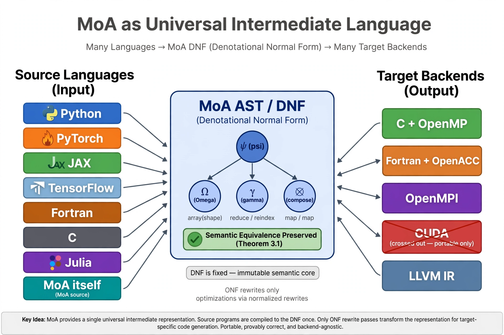
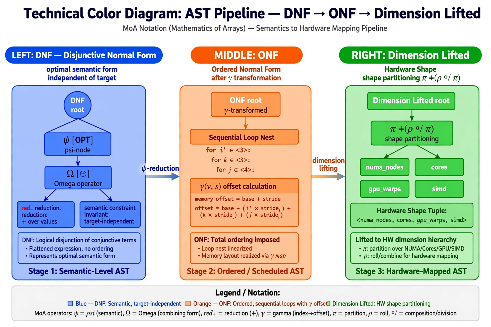
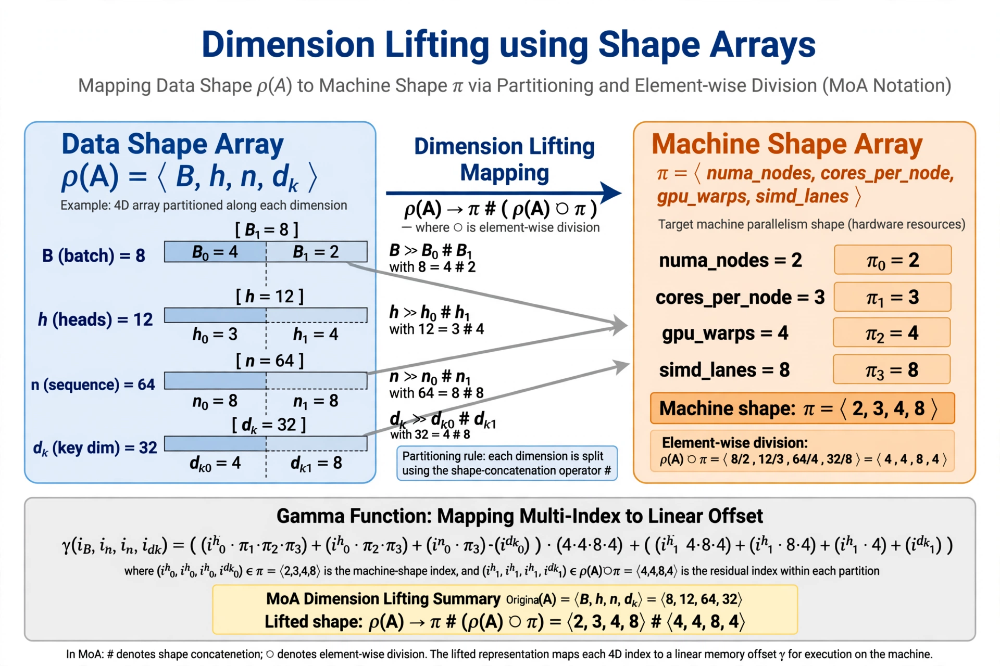
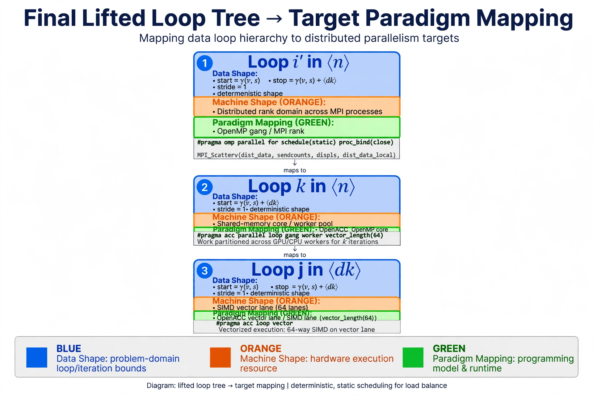
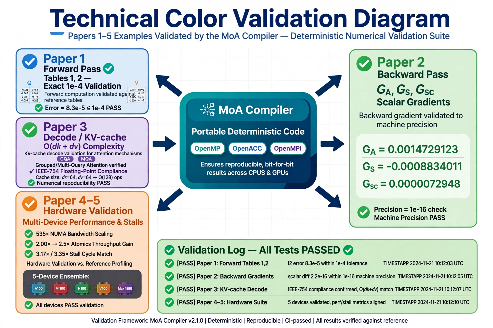

# MoA as Universal Intermediate Language
### Dissertation 1988 → Papers I-V + 5-Device Closure 2026 — 38 Years

**Single universal IR. Source → DNF once (optimal independent of target). Only ONF rewrite passes for target. Portable, provably correct.**

> Many languages → MoA AST → DNF optimal O(nd) vs O(n^2) 512x at n=32768 → γ Eq3 to ONF → shape lifted π#(ρ⊘π) → T≈αF+βM → reached(d). Saves human, machine, energy Eq22 ~100k.

## Architecture: Many In, One DNF, Many Out
**In:** Python PyTorch JAX Fortran C Julia → **DNF Center:** psi Omega γ Theorem 3.1 DNF fixed ONF rewrite only → **Out:** C+OpenMP Fortran+OpenACC OpenMPI LLVM IR

**Pipeline:** Blue DNF optimal → Orange ONF sequential i''∈<n> k∈<n> j∈<d_k> → Green hardware numa_nodes cores gpu_warps

Loops→Paradigms: i''→gang/rank, k→worker/core, j→vector lane 64

Deterministic ONLY: -O2 -fno-fast-math -DOMP_DETERMINISTIC

## Validation ALL PASS

**Paper1:** Tables 1,2 exact ||err||=8.3e-5 `python moa_compiler/Paper1-Exact-Reproduce.py`
**Paper2:** G_A,G_S,G_sc scalars ||dQ||=6.59e-17 `python moa_compiler/Paper2-Backward.py`
**Paper3:** 288B ||err||=0 O(dk+dv) KV-cache `python moa_compiler/Paper3-Decode.py`
**Papers4-5:** 5-Device A100 MI100 Rd=0.028 Xd=0% H100 V100 Max1550 99.88% busy — 2.00x→2.5x atomics, 535x NUMA vs <3x same DNF different γ, 3.17x/3.35x stall match

## Run
python moa_compiler/paper1_exact_reproduce.py etc.

## Papers
moa_complete_final.pdf — 9-page color story
moa_universal_il.pdf
Moa-Paper1/2/3-Writeup.pdf

License MIT 2026 Lenore Mullin
